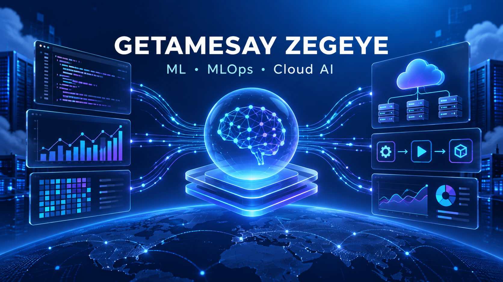

  

<h1 align="center">Getamesay Zegeye — Professional Portfolio</h1>

  Machine Learning • MLOps • Enterprise Cloud AI • Data Analytics • Database Systems

  <a href="https://getamesay-ml-cloud-ai.astute-cove-1824.chatgpt.site"><strong>View Live Portfolio</strong></a>
  ·
  <a href="https://www.linkedin.com/in/getamesay-zegeye-7570702b7"><strong>LinkedIn</strong></a>
  ·
  <a href="https://github.com/Get-AZ"><strong>GitHub Profile</strong></a>

## Professional Summary

Computer Science, AI, and Data Science educator and practitioner with extensive teaching experience and a project portfolio spanning applied machine learning, deep learning, natural language processing, recommender systems, production MLOps, Azure cloud deployment, business intelligence, and relational databases. Microsoft Azure Data Fundamentals (DP-900) certified.

## Core Competencies

- **Machine Learning:** classification, clustering, feature engineering, evaluation, leakage prevention, fairness auditing
- **Deep Learning:** artificial neural networks, CNNs, transfer learning, LSTMs, transformers, autoencoders
- **MLOps:** Flask, Gunicorn, Docker, MLflow, DVC, pytest, GitHub Actions, model packaging and monitoring
- **Cloud AI:** Azure Machine Learning, managed endpoints, model registry, deployment monitoring and governance
- **Analytics:** Power BI, Tableau, data visualization, KPI dashboards and geospatial analysis
- **Programming and Data:** Python, pandas, NumPy, scikit-learn, TensorFlow/Keras, Hugging Face and PostgreSQL

## Featured Projects

| Level | Project | Focus |
|---|---|---|
| 1 | [Diabetes Diagnosis Prediction](https://github.com/Get-AZ/Project_1_Diabetes_Diagnosis_Prediction) | Governed logistic-regression classification with reproducibility evidence |
| 2 | [Customer Segmentation](https://github.com/Get-AZ/Level-2-Customer_Segmentation) | RFM analysis and K-Means customer clustering |
| 3 | [Customer Churn Prediction](https://github.com/Get-AZ/Level-3-Customer-Churn) | Leakage-aware classification, fairness auditing and governance |
| 4 | [Sentiment Analysis](https://github.com/Get-AZ/Level-4-Sentiment_Analysis_Project) | TF-IDF baselines, LSTM and DistilBERT on IMDB reviews |
| 5 | [Plant Disease Classification](https://github.com/Get-AZ/Level-5-Plant-Disease-Classification) | Tomato-leaf image classification with CNN and MobileNetV2 |
| 6 | [Neural Network Project](https://github.com/Get-AZ/Level_6_Neural_Network_Project) | Optimized ANN for bank-marketing prediction |
| 7 | [Movie Recommendation System](https://github.com/Get-AZ/Movie_Recommendation_System) | MovieLens 32M collaborative, content-based and popularity recommendation |
| 8 | [Production MLOps](https://github.com/Get-AZ/Level_8_MLOps_Project) | Flask API, Docker, MLflow, DVC, testing and CI/CD |
| 9 | [Enterprise Cloud ML](https://github.com/Get-AZ/Level-9-Enterprise-Cloud-ML) | Azure ML registry, managed endpoint deployment and monitoring evidence |

## Business Intelligence

- [Power BI Analytics Portfolio](https://github.com/Get-AZ/Power-BI-Analytics-Portfolio) — executive dashboards for revenue, profit, product performance and purchase orders.
- [Tableau Analytics Portfolio](https://github.com/Get-AZ/Tableau-Analytics-Portfolio) — sales-performance and earthquake geospatial analysis workbooks.

## Database Projects

PostgreSQL portfolio work includes a student database project and an employee database exercise covering schema design, queries, joins, aggregation and database-management concepts.

## Selected Technical Evidence

- Level 4 DistilBERT: **91.97% accuracy**, **0.9201 F1**, **0.9749 ROC-AUC**
- Level 3 governed churn model: **0.9979 F1**, **0.999988 ROC-AUC**
- Level 6 ANN: **0.870 recall**, **0.929965 ROC-AUC**
- Level 8 production package: Docker, MLflow registry, DVC, automated tests and CI/CD
- Level 9 Azure deployment: managed online endpoint and production deployment certification completed

## Certification

- Microsoft Certified: Azure Data Fundamentals (DP-900)

## Education and Teaching

Teaching experience includes Computer Science, Artificial Intelligence, Data Science, object-oriented programming with Java, operating systems, computer graphics, networking, introductory computing and database administration.

## Explore the Portfolio

Visit the complete interactive portfolio for project summaries, skills and professional materials:

**[Open Getamesay Zegeye’s Live Portfolio](https://getamesay-ml-cloud-ai.astute-cove-1824.chatgpt.site)**

---

  Open to opportunities in machine learning, data science, analytics, cloud AI, MLOps and Computer Science education.

